# Client Live Voice Agent - Comprehensive Technical Documentation

## 🎤 Overview

The **Client Live Voice Agent** is a sophisticated real-time voice interface for insurance claims processing, built with Azure AI Foundry Voice Live API integration. It provides seamless voice interactions through WebSocket connections, intelligent voice activity detection, and advanced audio processing capabilities.

---

## 📁 Directory Structure Analysis

```
client_live_voice_agent/
├── __init__.py                    # Package initialization
├── fastapi_server.py             # Main FastAPI server with WebSocket support
├── voice_agent_executor.py       # Azure AI Foundry voice agent integration  
├── voice_websocket_handler.py    # WebSocket message handling for voice sessions
├── conversation_tracker.py       # Conversation state management
├── config/                       # Configuration modules
│   ├── __init__.py
│   ├── settings.py              # Application settings and constants
│   └── logging_config.py        # Logging configuration
├── routes/                       # FastAPI route handlers
│   ├── __init__.py
│   ├── a2a_routes.py            # A2A protocol endpoints
│   └── static_routes.py         # Static file serving routes
├── services/                     # Business logic services
│   ├── __init__.py
│   └── agent_service.py         # Agent lifecycle management
├── static/                       # Frontend assets
│   ├── claims_voice_client.html # Voice client interface
│   ├── claims_voice_client.js   # Advanced voice client implementation
│   ├── audio-processor.js       # Audio worklet for real-time processing
│   ├── config.example.js        # Configuration template
│   └── config.js               # Runtime configuration (ignored by git)
└── utils/                        # Utility modules
    ├── __init__.py
    └── response_utils.py         # Response handling utilities
```

---

## 🔧 Core Components Deep Dive

### 🚀 **fastapi_server.py** - Main Application Server
**Lines of Code**: 790  
**Primary Purpose**: FastAPI server orchestrating voice agent functionality

#### **Key Features:**
- **Dual Protocol Support**: Implements both A2A protocol endpoints and WebSocket connections
- **Static File Serving**: Serves voice client interface and JavaScript assets
- **CORS Configuration**: Enables cross-origin requests for web client access
- **Agent Card Endpoint**: Provides A2A-compliant agent discovery at `/.well-known/agent.json`

#### **Architecture Components:**
```python
# Core server initialization
app = FastAPI(
    title="Client Live Voice Agent",
    description="A2A-compliant voice agent with Azure AI integration",
    version="1.0.0"
)

# WebSocket endpoint for voice connections
@app.websocket("/ws/{session_id}")
async def websocket_voice_endpoint(websocket: WebSocket, session_id: str)

# A2A protocol endpoints
app.include_router(a2a_routes.router)
app.include_router(static_routes.router)
```

#### **Initialization Flow:**
1. **Agent Service Setup**: Creates `AgentService` instance for lifecycle management
2. **Voice Executor Initialization**: Initializes Azure AI Foundry voice agent
3. **WebSocket Handler Configuration**: Sets up real-time voice communication
4. **Database Connectivity Check**: Verifies Cosmos DB and MCP server connections
5. **Server Startup**: Launches FastAPI server on port 8007

---

### 🧠 **voice_agent_executor.py** - Azure AI Integration Core
**Lines of Code**: 894  
**Primary Purpose**: Azure AI Foundry voice agent implementation with A2A protocol compliance

#### **Key Capabilities:**
- **Azure AI Foundry Integration**: Uses `AIProjectClient` for voice agent management  
- **Thread Management**: Maintains conversation threads across voice sessions
- **Tool Integration**: Implements MCP tools for Cosmos DB data access
- **A2A Protocol**: Implements `AgentExecutor` interface for agent communication

#### **Core Methods:**
```python
class VoiceAgentExecutor(AgentExecutor):
    async def initialize(self):
        """Initialize Azure AI client and voice agent"""
    
    async def execute(self, request_context: RequestContext) -> AsyncGenerator[Dict[str, Any], None]:
        """Process voice interactions through Azure AI Foundry"""
    
    async def _initialize_azure_resources(self):
        """Setup Azure AI project client and voice agent"""
    
    async def _process_voice_interaction(self, message: str, session_id: str):
        """Handle individual voice messages"""
```

#### **Azure Integration Details:**
- **Project Client**: Connects to Azure AI Foundry workspace
- **Voice Agent**: Creates dedicated voice agents for claims assistance
- **Thread Storage**: Maintains conversation history in Azure AI threads
- **Tool Definitions**: Integrates with Cosmos DB through MCP protocol

---

### 🌐 **voice_websocket_handler.py** - Real-time Communication Hub
**Lines of Code**: 380  
**Primary Purpose**: WebSocket message handling for voice sessions with Azure thread integration

#### **Core Features:**
- **Connection Management**: Handles WebSocket lifecycle (connect/disconnect/reconnect)
- **Message Processing**: Processes voice session events and transcriptions
- **Session Tracking**: Maps WebSocket connections to conversation sessions
- **Azure Thread Storage**: Stores voice interactions in Azure AI Foundry threads

#### **Message Event Handling:**
```python
# Supported WebSocket message types
- "session.created"                    # Voice session initialization
- "conversation.item.created"          # New conversation items
- "input_audio_buffer.speech_started"  # User speech detection
- "input_audio_buffer.speech_stopped"  # User speech completion  
- "response.created"                   # AI response initiation
- "response.done"                      # AI response completion
- "error"                              # Error handling
```

#### **Advanced Features:**
- **Dual Storage**: Logs to both conversation tracker AND Azure AI threads
- **Error Resilience**: Graceful fallback if Azure thread storage fails
- **Session Mapping**: Maintains connection_id to session_id relationships
- **Broadcasting**: Supports message broadcasting to multiple connections

---

### 📊 **conversation_tracker.py** - Session State Management  
**Lines of Code**: 62  
**Primary Purpose**: Unified conversation tracking interface

#### **Implementation:**
```python
class MockConversationTracker:
    """
    Provides no-op implementations for conversation tracking
    Supports both FastAPI server and Voice Agent Executor interfaces
    """
    
    # Session management
    def start_session(self, session_data)
    def end_session(self, *args, **kwargs)
    
    # Logging interfaces  
    def log_voice_interaction(self, *args, **kwargs)
    def log_agent_response(self, *args, **kwargs)
    def log_system_event(self, *args, **kwargs)
```

---

## ⚙️ Configuration Layer

### 🔧 **config/settings.py** - Application Configuration
**Primary Purpose**: Centralized configuration constants

#### **Configuration Categories:**
```python
# Server Configuration
SERVER_HOST = "0.0.0.0"
SERVER_PORT = 8007

# Agent Identity
AGENT_ID = "client_live_voice_agent"
AGENT_INPUT_MODES = ['audio', 'text']
AGENT_OUTPUT_MODES = ['audio', 'text']

# CORS Settings
CORS_ORIGINS = ["*"]  # Development setting
```

### 📝 **config/logging_config.py** - Logging Setup
**Primary Purpose**: Standardized logging configuration

#### **Features:**
- **Custom Format**: `🎤 [VOICE-AGENT-FASTAPI] timestamp - level - message`
- **Azure Suppression**: Reduces verbose Azure SDK logging
- **Centralized Setup**: Single point for logging configuration

---

## 🛣️ Routing Layer

### 🔗 **routes/a2a_routes.py** - A2A Protocol Endpoints
**Lines of Code**: 86  
**Primary Purpose**: A2A protocol compliance endpoints

#### **Key Endpoints:**
```python
@router.get("/.well-known/agent.json")
async def get_agent_card():
    """A2A Agent Card endpoint with voice capabilities"""
```

#### **Agent Card Structure:**
```json
{
  "name": "ClientLiveVoiceAgent",
  "description": "Voice-based insurance claims assistance",
  "url": "http://localhost:8007/",
  "defaultInputModes": ["audio", "text"],
  "defaultOutputModes": ["audio", "text"],
  "capabilities": {
    "voiceInteraction": true,
    "realtimeProcessing": true
  }
}
```

### 📁 **routes/static_routes.py** - Static Asset Serving
**Lines of Code**: 76  
**Primary Purpose**: Serve frontend assets with error handling

#### **Served Assets:**
- `/` → `claims_voice_client.html` (Main interface)
- `/claims_voice_client.js` → JavaScript client implementation
- `/audio-processor.js` → Audio worklet processor
- `/config.js` → Runtime configuration

---

## 🧩 Services Layer

### 🎯 **services/agent_service.py** - Agent Lifecycle Management
**Lines of Code**: 180  
**Primary Purpose**: Centralized agent initialization and management

#### **Initialization Sequence:**
```python
async def initialize(self) -> AgentCard:
    1. Create VoiceAgentExecutor instance
    2. Initialize Azure AI resources  
    3. Check database readiness (Cosmos DB + MCP)
    4. Connect to WebSocket handler
    5. Create and return A2A agent card
```

#### **Database Readiness Check:**
- **Primary**: Direct Cosmos DB connection
- **Fallback**: MCP server access
- **Result**: Reports available connection methods

---

## 🎨 Frontend Assets

### 🎯 **static/claims_voice_client.js** - Advanced Voice Client
**Lines of Code**: 981  
**Primary Purpose**: Sophisticated voice interaction client with Azure Voice Live API integration

#### **Core Architecture:**
```javascript
class ClaimsVoiceLiveClient {
    constructor() {
        // Audio processing
        this.sampleRate = 24000
        this.audioContext = null
        this.audioWorkletNode = null
        
        // Voice activity detection
        this.scheduledSources = []
        this.bargeInCooldownMs = 1200
        
        // Configuration from config.js
        this.endpointValue = window.AZURE_CONFIG?.endpoint
        this.apiKeyValue = window.AZURE_CONFIG?.apiKey
    }
}
```

#### **Voice Activity Detection (VAD):**
- **Type**: `azure_semantic_vad` for intelligent speech detection
- **Threshold**: 0.4 (balanced sensitivity)
- **Barge-in**: Smart interruption with 1200ms cooldown
- **Audio Processing**: 24kHz sample rate with noise suppression

#### **WebSocket Integration:**
```javascript
// WebSocket connection to Azure Voice Live API
const wsUrl = `${endpoint}/voice-live/realtime?api-version=2025-05-01-preview&model=${model}&api-key=${apiKey}`

// Audio processing pipeline
initializeAudio() → AudioWorklet → base64 encoding → WebSocket streaming
```

### 🎵 **static/audio-processor.js** - Real-time Audio Processing
**Lines of Code**: 50  
**Primary Purpose**: AudioWorklet processor for low-latency audio capture

#### **Processing Flow:**
```javascript
class AudioProcessor extends AudioWorkletProcessor {
    1. Buffer audio in 50ms chunks (1200 samples at 24kHz)
    2. Convert Float32 to Int16 for Azure API compatibility  
    3. Send processed audio to main thread via postMessage
    4. Reset buffer for continuous processing
}
```

### 🌐 **static/claims_voice_client.html** - User Interface
**Lines of Code**: 344  
**Primary Purpose**: Professional voice client interface

#### **UI Components:**
- **Header**: Branding and status display
- **Chat Area**: Real-time conversation display  
- **Controls**: Start/Stop voice interaction buttons
- **Status Indicators**: Connection and processing state
- **Responsive Design**: Mobile-friendly layout

#### **Styling Features:**
- **Gradient Backgrounds**: Modern visual appeal
- **Status Colors**: Red (disconnected), Yellow (connecting), Green (connected)
- **Chat Bubbles**: Distinct styling for user/assistant messages
- **Loading Animations**: Visual feedback during processing

---

## 🛠️ Utilities Layer

### 🔧 **utils/response_utils.py** - Response Handling Utilities
**Lines of Code**: 45  
**Primary Purpose**: Standardized response creation and static file serving

#### **Utility Functions:**
```python
def create_error_response(status_code, message, detail=None) → JSONResponse
def create_success_response(data: Dict) → JSONResponse  
def serve_static_file(file_path, media_type, not_found_message) → FileResponse
def create_fallback_html(title, message, agent_card_url) → HTMLResponse
```

---

## 🔄 System Integration Flow

### **Voice Interaction Lifecycle:**

```mermaid
graph TB
    A[User speaks] --> B[Audio Worklet captures]
    B --> C[Float32 → Int16 conversion] 
    C --> D[Base64 encoding]
    D --> E[WebSocket to Azure Voice Live API]
    E --> F[Voice Agent Executor processing]
    F --> G[Call to Cosmos DB]
    G --> H[Response generation]
    H --> I[Audio playback to user]
    I --> J[Conversation logging]
```


### **A2A Protocol Integration:**


---

## 🚀 Deployment and Configuration

### **Environment Requirements:**
```env
# Azure AI Foundry Configuration
AZURE_AI_AGENT_MODEL_DEPLOYMENT_NAME=gpt-4o
AZURE_AI_AGENT_ENDPOINT=https://your-region.api.azureml.ms/agents/v1.0/...
AZURE_AI_AGENT_SUBSCRIPTION_ID=your-subscription-id
AZURE_AI_AGENT_RESOURCE_GROUP_NAME=your-resource-group
AZURE_AI_AGENT_PROJECT_NAME=your-ai-foundry-project
AZURE_AI_AGENT_ID=your-agent-assistant-id

# Cosmos DB Configuration  
COSMOS_ENDPOINT=https://your-cosmos-account.documents.azure.com:443/
COSMOS_KEY=your-cosmos-primary-key
COSMOS_DATABASE=insurance
COSMOS_CONTAINER=claim_details
```

### **Frontend Configuration:**
```javascript
// config.js (created from config.example.js)
window.AZURE_CONFIG = {
    endpoint: "https://voice-liveresource.cognitiveservices.azure.com/",
    apiKey: "YOUR_AZURE_VOICE_API_KEY_HERE",  
    model: "gpt-4o-realtime-preview",
    voice: "en-US-JennyMultilingualNeural"
};
```

### **Startup Sequence:**
```bash
# 1. Activate virtual environment
cd insurance_agents
.\.venv\Scripts\activate

# 2. Navigate to voice agent directory
cd agents/client_live_voice_agent

# 3. Start FastAPI server
python fastapi_server.py

# 4. Access voice interface
# Browser: http://localhost:8007
```

---

## 🔍 Advanced Technical Features

### **Smart Audio Management:**
- **Buffering Strategy**: Accumulates 5+ audio chunks before processing
- **Seamless Playback**: Uses `AudioContext.currentTime` for precise scheduling
- **Interruption Handling**: Immediate audio cancellation on user speech detection
- **Error Recovery**: Graceful fallback on audio processing failures

### **Voice Activity Detection:**
- **Semantic VAD**: Understands speech context beyond volume detection
- **Barge-in Prevention**: Cooldown mechanism prevents false interruptions  
- **Filler Word Removal**: Automatically filters "um", "ah" during processing
- **End-of-Utterance**: Intelligent detection using semantic models

### **Real-time Processing:**
- **Low Latency**: AudioWorklet ensures minimal audio processing delay
- **Streaming**: Continuous audio streaming without buffering delays
- **Concurrent Processing**: Handles multiple voice sessions simultaneously
- **State Management**: Maintains conversation context across interruptions

---

## 📊 Performance Characteristics

### **Audio Processing:**
- **Sample Rate**: 24kHz for high-quality voice processing
- **Buffer Size**: 1200 samples (50ms) for optimal latency/quality balance
- **Bit Depth**: 16-bit PCM for Azure API compatibility
- **Processing Delay**: <50ms end-to-end audio latency

### **WebSocket Performance:**
- **Connection Handling**: Supports multiple concurrent voice sessions
- **Message Processing**: Real-time event handling without blocking
- **Error Resilience**: Automatic reconnection and graceful degradation
- **Memory Management**: Efficient cleanup of audio buffers and connections

### **Integration Scalability:**
- **Azure AI Foundry**: Leverages cloud-scale AI processing
- **Cosmos DB**: Distributed database for claims data storage
- **A2A Protocol**: Enables integration with multiple agent systems
- **Microservice Architecture**: Modular design for independent scaling

---

## 🛡️ Security Considerations

### **API Key Management:**
- **Configuration Separation**: Sensitive keys stored in `config.js` (git-ignored)
- **Environment Variables**: Server-side credentials in `.env` files
- **Example Templates**: Safe `config.example.js` for repository sharing

### **WebSocket Security:**
- **CORS Configuration**: Controlled cross-origin access
- **Connection Validation**: Session-based connection management
- **Error Handling**: Sanitized error messages to prevent information leakage

### **Data Protection:**
- **Conversation Logging**: Structured logging without sensitive data exposure
- **Azure Integration**: Leverages Azure's enterprise security features
- **Database Access**: Secured Cosmos DB connections with managed identity support

---

This comprehensive documentation provides complete technical understanding of the Client Live Voice Agent architecture, implementation details, and operational characteristics. The system represents a sophisticated integration of modern voice processing, AI services, and real-time communication technologies for insurance claims processing.