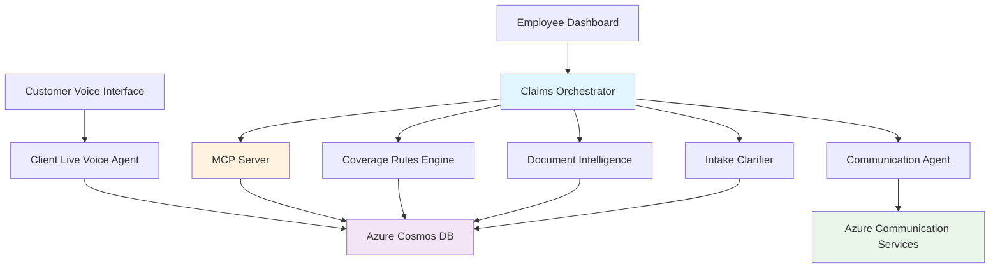

# 🏥 AI-Powered Insurance Claims Processing System

A modern, intelligent insurance claims processing platform built with **Azure AI Foundry**, **Agent-to-Agent (A2A) Protocol**, and **Model Context Protocol (MCP)** for automated claim validation, document processing, and coverage evaluation.


## 🚀 Overview

This system revolutionizes insurance claims processing through **intelligent agent orchestration**, providing:

- **🎤 Real-time Voice Interface** for customer claim submissions
- **🤖 AI-Powered Agent Orchestration** with dynamic routing
- **📄 Automated Document Intelligence** for claim validation
- **🛡️ Smart Coverage Rules Engine** for policy evaluation
- **📱 Professional Dashboard** for claims processing employees
- **📧 Automated Notifications** via email/SMS

## ✨ Key Features

### 🎯 **Intelligent Agent Architecture**
- **Claims Orchestrator**: Azure AI-powered routing and workflow management
- **Voice Agent**: Real-time voice interactions with Azure Voice Live API
- **Document Intelligence**: Automated PDF processing and data extraction
- **Coverage Rules Engine**: AI-driven policy evaluation and benefit calculations
- **Communication Agent**: Multi-channel notifications (email, SMS)

### 🔄 **Modern Protocols**
- **A2A Protocol**: Seamless agent-to-agent communication
- **MCP Protocol**: Standardized database interactions with Cosmos DB
- **WebSocket**: Real-time voice and chat communications
- **RESTful APIs**: Dashboard and external system integrations

### 📊 **Real-time Monitoring**
- Live workflow tracking with step-by-step visibility
- Agent health monitoring and capability discovery
- Performance metrics and execution history
- Professional employee dashboard with claims management

## 🏗️ Current Architecture



## 🛠️ Technology Stack

| Category | Technology | Purpose |
|----------|------------|---------|
| **AI Framework** | Azure AI Foundry | Agent orchestration and intelligent routing |
| **Communication** | A2A Protocol | Agent-to-agent communication |
| **Database** | Azure Cosmos DB + MCP | Scalable data storage with protocol standardization |
| **Voice Interface** | Azure Voice Live API | Real-time voice interactions |
| **Document Processing** | Azure Document Intelligence | PDF analysis and data extraction |
| **Web Framework** | FastAPI + WebSocket | High-performance APIs and real-time communication |
| **Agent Framework** | Semantic Kernel | AI agent creation and management |
| **Notifications** | Azure Communication Services | Email and SMS delivery |

## 🚀 Quick Start

### Prerequisites
- Python 3.11+
- Azure subscription with AI services
- Azure Cosmos DB account
- Virtual environment support

### 1. Environment Setup
```bash
# Clone the repository
git clone https://github.com/devusermeta/insurance_test.git
cd insurance_test

# Navigate to agents directory and activate virtual environment
python -m venv .venv
.\.venv\Scripts\activate  # Windows
# source .venv/bin/activate  # Linux/Mac


# Install dependencies
pip install -r req.txt (dependencies without version)
pip install -r requirements.txt (dependencies with version)
```

### 2. Environment Configuration Setup

The project uses multiple `.env` files for different components. **Quick setup**: Copy all `.env.example` files to `.env` and update with your credentials.

```bash
# Quick setup - Copy all environment files at once
cp .env.example .env
cp insurance_agents\.env.example insurance_agents\.env
cp insurance_agents\agents\claims_orchestrator\.env.example insurance_agents\agents\claims_orchestrator\.env
cp azure-cosmos-mcp-server\python\.env.example azure-cosmos-mcp-server\python\.env
```

#### Detailed Setup for Each Component:

#### 🏗️ Main Project Configuration
```bash
# Root directory - Overall system configuration
cd insurance
cp .env.example .env
```
**Edit `.env` with:**
- Cosmos DB endpoint and primary key
- MCP server and agent port configurations
- Dashboard port settings

#### 🤖 Insurance Agents Configuration  
```bash
# Insurance agents directory - Agent-specific settings
cd insurance_agents
cp .env.example .env
```
**Edit `insurance_agents\.env` with:**
- Cosmos DB connection settings for claims processing
- MCP server configuration
- Logging preferences
- Optional Azure Identity settings

#### 🧠 Claims Orchestrator Configuration
```bash
# Claims orchestrator agent - Azure AI Foundry settings
cd insurance_agents\agents\claims_orchestrator
cp .env.example .env
```
**Edit `claims_orchestrator\.env` with:**
- Azure AI Foundry workspace details
- Agent deployment configurations
- AI model settings

#### 🌐 Cosmos MCP Server Configuration
```bash
# Azure Cosmos MCP server - Database connectivity
cd azure-cosmos-mcp-server\python
cp .env.example .env
```
**Edit `azure-cosmos-mcp-server\python\.env` with:**
- Cosmos DB URI and access key
- MCP server host and port settings
- Optional managed identity configuration

### 3. Configure Azure Services

Create the following Azure resources and update your `.env` file:

#### Required Azure Resources:
- **Azure AI Foundry Workspace** (for agent orchestration)
- **Azure Cosmos DB Account** (for claims data storage)
- **Azure OpenAI Service** (for AI model deployment)
- **Azure Document Intelligence** (for PDF processing)
- **Azure Communication Services** (for notifications)
- **Azure Voice Live API** (for real-time voice interactions)

```env
# Azure AI Foundry Configuration (preferably create in eastus2 location)
AZURE_AI_AGENT_MODEL_DEPLOYMENT_NAME=gpt-4o
AZURE_AI_AGENT_ENDPOINT=https://your-region.api.azureml.ms/agents/v1.0/subscriptions/{subscription-id}/resourceGroups/{resource-group}/providers/Microsoft.MachineLearningServices/workspaces/{workspace-name}
AZURE_AI_AGENT_SUBSCRIPTION_ID=your-subscription-id
AZURE_AI_AGENT_RESOURCE_GROUP_NAME=your-resource-group-name
AZURE_AI_AGENT_PROJECT_NAME=your-ai-foundry-project-name
AZURE_AI_AGENT_ID=your-agent-id

# Azure Cosmos DB Configuration
COSMOS_ENDPOINT=https://your-cosmos-account.documents.azure.com:443/
COSMOS_KEY=your-cosmos-primary-key
COSMOS_DATABASE=insurance
COSMOS_CONTAINER=claim_details

# Azure OpenAI Configuration
AZURE_OPENAI_ENDPOINT=https://your-openai-resource.openai.azure.com/
AZURE_OPENAI_API_KEY=your-openai-api-key
AZURE_OPENAI_DEPLOYMENT_NAME=gpt-4o
AZURE_OPENAI_API_VERSION=2024-02-15-preview

# Azure Document Intelligence Configuration
AZURE_DOCUMENT_INTELLIGENCE_ENDPOINT=https://your-doc-intel-resource.cognitiveservices.azure.com/
AZURE_DOCUMENT_INTELLIGENCE_KEY=your-document-intelligence-key

# Azure Communication Services Configuration
AZURE_COMMUNICATION_CONNECTION_STRING=endpoint=https://your-communication-resource.communication.azure.com/;accesskey=your-access-key
AZURE_COMMUNICATION_SENDER_EMAIL=DoNotReply@your-domain.azurecomm.net

# Azure Voice Live API Configuration
AZURE_VOICE_LIVE_ENDPOINT=https://your-voice-resource.cognitiveservices.azure.com/
AZURE_VOICE_LIVE_API_KEY=your-voice-api-key
AZURE_VOICE_LIVE_MODEL=gpt-4o-realtime-preview

# MCP Server Configuration
MCP_SERVER_HOST=localhost
MCP_SERVER_PORT=8080

# Agent Ports Configuration
A2A_CLAIMS_ORCHESTRATOR_PORT=8001
A2A_INTAKE_CLARIFIER_PORT=8002
A2A_DOCUMENT_INTELLIGENCE_PORT=8003
A2A_COVERAGE_RULES_ENGINE_PORT=8004
A2A_COMMUNICATION_AGENT_PORT=8005
VOICE_LIVE_AGENT_PORT=8007

# Dashboard Configuration
DASHBOARD_PORT=3000
```

### 4. Frontend Configuration Setup

For the voice interface frontend, you'll need to configure API endpoints and credentials:

1. Navigate to the voice agent static directory:
   ```bash
   cd insurance_agents/agents/client_live_voice_agent/static/
   ```

2. Copy the example configuration file:
   ```bash
   cp config.example.js config.js
   ```

3. Edit `config.js` with your actual Azure credentials:
   - Replace `YOUR_AZURE_VOICE_API_KEY_HERE` with your Azure Voice Live API key
   - Replace `YOUR_COSMOS_DB_PRIMARY_KEY_HERE` with your Cosmos DB primary key
   - Update the endpoints to match your Azure resource URLs


**Important**: Never commit `config.js` to version control as it contains sensitive credentials. The file is already included in `.gitignore`.

### 5. Start the System
```bash
# Start Cosmos MCP Server (Create new Terminal 1)
Activate the terminal -> .venv/scripts/activate
cd azure-cosmos-mcp-server/python
python cosmos_server.py

# Start Core Agents (Create new 4 Terminals 2-6)
Activate the terminal -> .venv/scripts/activate  (Do for every terminal)
cd insurance_agents
python -m agents.claims_orchestrator
python -m agents.intake_clarifier
python -m agents.document_intelligence_agent
python -m agents.coverage_rules_engine
python -m agents.communication_agent

# Start Voice Interface (Create new Terminal 7)
Activate the terminal -> .venv/scripts/activate 
cd agents/client_live_voice_agent
python fastapi_server.py

# Start Employee Dashboard (Create new Terminal 8)
Activate the terminal -> .venv/scripts/activate 
cd insurance_agents_registry_dashboard
python app.py
```


### 5.1. Access the System for external customer(Voice Live API Scenerio)
- **Voice Interface**: http://localhost:8007

### 5.2. Access the System for internal employee (Accessing multi-agent for claim processing scenerio)
- **Claims Dashboard**: http://localhost:3000
- **Agent Registry**: http://localhost:3000/static/agent_registry.html
- **To view agent card**: http:localhost:8001/.well-known/agent.json (for orchestrator agent port- 8001)
-- **To view other agent** cards use respective ports with above URL.

## 📱 Usage Examples

### Example 1: For internal employee workflow claim processing by internal employee with multi-agent system
```javascript
// Employee types in the chat window: "Process the claim id OP-03"
// Claims Orchestrator agent using MCP fetches the details from cosmos DB with claim id OP-03 and displays the results in chat with asking for confirmation to proceed further.
// Internal Employee types in 'yes' and then 
// claims orchestrator responds with intelligent routing to appropriate agents eg. Rules engine to verify rules, Document intelligence agent to extract details from the uploaded documents and intake clarifier agent to verify the extracted data with the submitted data (eg. Bill Amount, Patient  Name, Diagnosis) and update status(marked for approval, marked for rejection), updated by (intake clarifier), verification reason(data verification failed bill amount mismatched/ Data verification passed), verification timestamp.

// If conditions match the claims orchestrator will call the communication agent with ACS to send email and then displays the status on the chat window.
```

### Example 2: For external customers calling agent with voice live API to check claim status and get other details
```javascript

//Customer speaks: What is the status of claim id IP-05.
//Client_Live_Voice_Agent: Using IP-05 checks cosmosDB for existence of that claim, if IP-05 exisits it will fetch the details and share as context,
//If a claim with claim ID IP-05 does not exist it will reply this claim IP-05 does not exist.


//Barge in feature

//While the agent is speaking about the information of claim IP-05 as context, customer can interrupt in between and ask what is the status of the claim(submitted/marked for approval/ marked for rejection).
//Client_Live_Voice_Agent will display the current context but stops speaking and starts listening to the customer voice

//Converts the speech to text, displays the text - eg. What is the status of claim IP-05 and then share the status from the previously fetched context - eg. submitted

//Again while the agent is speaking customer can interrupt and ask - how many documents were submitted?

//Agent will stop speaking, display the current context and starts listening to the customer, uses STT(gpt-4o-realtime-preview) displays the customer speech as text and using previous context voice out the number of documents uploaded.

//Customer can again interrupt and ask any pending documents, agent stops speaking and displays customer speech as text and updates that there are no pending documents. 
```


## 📊 System Components

### Core Agents
| Agent | Port | Purpose | Key Features |
|-------|------|---------|--------------|
| **Claims Orchestrator** | 8001 | Main coordination | AI routing, workflow management |
| **Intake Clarifier** | 8002 | Data validation | Claim verification, consistency checks |
| **Document Intelligence** | 8003 | Document processing | PDF text extraction, OCR along with LLM, structured data |
| **Coverage Rules** | 8004 | Policy evaluation | Insurance Limit and rule validation |
| **Communication** | 8005 | Notifications | Email |
| **Voice Agent** | 8007 | Customer interface | Real-time voice with voice live api, WebSocket |

### Data Collections 

**Coverage rules are embedded in the instructions of coverage rules engine agent**
**COSMOS DB:**
- *claim_details*: Main claim records with patient and provider information
- *extracted_patient_data*: Details from the document intelligence results.

**BLOB STORAGE:**
This has pdf documents for the inpatient and outpatient. For samples refer to Database Samples directory


## Disclaimer
**This project is for non production demo purpose only. Do not use in production enviornment.**

## 🙏 Acknowledgments

- **Azure AI Platform** for providing robust AI services
- **A2A Protocol Community** for agent communication standards
- **Model Context Protocol** for database interaction standardization
- **FastAPI Community** for excellent web framework
- **Semantic Kernel** for AI agent orchestration capabilities

## 📚 More Information

- **[Developer Documentation](DEVELOPER_DOCUMENTATION.md)** - Comprehensive technical documentation for the entire system
- **[Client Live Voice Agent Documentation](CLIENT_LIVE_VOICE_AGENT_DOCUMENTATION.md)** - Detailed documentation for the voice agent component

---
